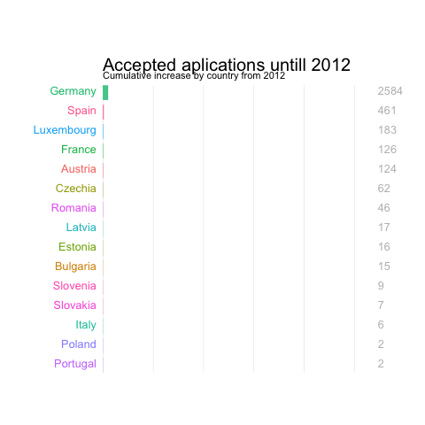

```{r setup, include=FALSE}
knitr::opts_chunk$set(echo = TRUE)
```

```{r testing, fig.cap="example caption"}

```

```{r}
library(shiny)
shiny::includeHTML("plots/plot_1.html") 
```

```{r}
shiny::includeHTML("plots/plot_2.html") 
```